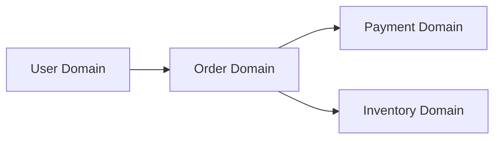

# 도메인 정의서

## 개요

프로젝트명: [프로젝트명]
작성일: [YYYY-MM-DD]
버전: [v1.0.0]

## 도메인 컨텍스트

### 비즈니스 목표

- [핵심 비즈니스 목표 1]
- [핵심 비즈니스 목표 2]
- [핵심 비즈니스 목표 3]

### 도메인 경계

- **핵심 도메인(Core Domain)**

  - [도메인명]: [책임과 역할]
  - 핵심 가치: [비즈니스 핵심 가치]

- **지원 도메인(Supporting Domain)**

  - [도메인명]: [책임과 역할]

- **일반 도메인(Generic Domain)**
  - [도메인명]: [표준 솔루션 활용 영역]

## 도메인 모델

### 주요 엔티티

| 엔티티명 | 설명   | 주요 속성  | 도메인       |
| -------- | ------ | ---------- | ------------ |
| [Entity] | [설명] | [속성목록] | [소속도메인] |

### 도메인 간 관계

