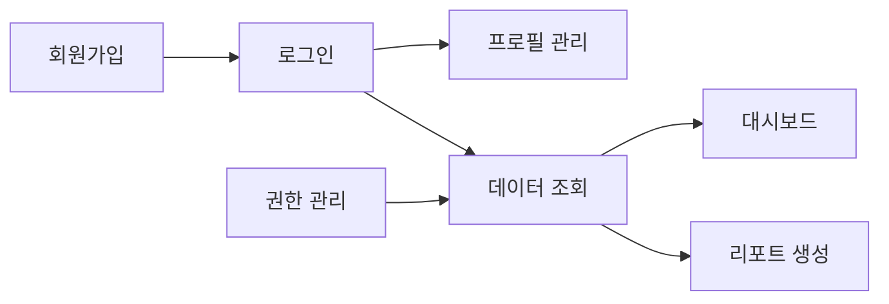

# 기능 목록

## 프로젝트 정보

- **프로젝트명**: [프로젝트명]
- **작성일**: [YYYY-MM-DD]
- **버전**: [v1.0.0]

## 기능 분류

### 🔐 인증 및 권한 관리

| ID   | 기능명          | 설명                             | 복잡도 | 도메인 | 상태 |
| ---- | --------------- | -------------------------------- | ------ | ------ | ---- |
| F001 | 회원가입        | 이메일 기반 신규 사용자 등록     | Medium | User   | 대기 |
| F002 | 로그인/로그아웃 | 사용자 인증 및 세션 관리         | Low    | Auth   | 대기 |
| F003 | 비밀번호 재설정 | 이메일 인증을 통한 비밀번호 변경 | Medium | Auth   | 대기 |
| F004 | 프로필 관리     | 사용자 정보 조회 및 수정         | Low    | User   | 대기 |
| F005 | 권한 관리       | 역할 기반 접근 제어 (RBAC)       | High   | Auth   | 대기 |

### 💼 핵심 비즈니스 기능

| ID   | 기능명   | 설명   | 복잡도 | 도메인   | 상태 |
| ---- | -------- | ------ | ------ | -------- | ---- |
| F010 | [기능명] | [설명] | High   | [도메인] | 대기 |
| F011 | [기능명] | [설명] | Medium | [도메인] | 대기 |
| F012 | [기능명] | [설명] | Medium | [도메인] | 대기 |

### 📊 데이터 관리

| ID   | 기능명      | 설명                          | 복잡도 | 도메인 | 상태 |
| ---- | ----------- | ----------------------------- | ------ | ------ | ---- |
| F020 | 데이터 조회 | 필터링 및 정렬 기능           | Medium | Data   | 대기 |
| F021 | 데이터 생성 | 새 항목 추가 및 검증          | Medium | Data   | 대기 |
| F022 | 데이터 수정 | 기존 항목 업데이트            | Low    | Data   | 대기 |
| F023 | 데이터 삭제 | 항목 삭제 및 연관 데이터 처리 | Medium | Data   | 대기 |

### 🔔 알림 및 커뮤니케이션

| ID   | 기능명      | 설명                    | 복잡도 | 도메인 | 상태         |
| ---- | ----------- | ----------------------- | ------ | ------ | ------------ | ---- |
| F030 | 이메일 알림 | 중요 이벤트 이메일 발송 | P1     | Medium | Notification | 대기 |
| F031 | 인앱 알림   | 실시간 알림 표시        | P2     | High   | Notification | 대기 |

### 📈 리포트 및 분석

| ID   | 기능명      | 설명                           | 복잡도 | 도메인    | 상태 |
| ---- | ----------- | ------------------------------ | ------ | --------- | ---- |
| F040 | 대시보드    | 주요 지표 시각화               | High   | Analytics | 대기 |
| F041 | 리포트 생성 | 커스텀 리포트 생성 및 다운로드 | High   | Analytics | 대기 |

## 기능 상세 명세 (선택사항)

필요시 주요 기능 2-3개만 상세 명세 작성:

### [기능 ID]: [기능명]

**사용자 스토리**:

```
AS A [사용자 유형]
I WANT TO [원하는 기능]
SO THAT [기대 효과]
```

**주요 요구사항**:

- [요구사항 1]
- [요구사항 2]
- [요구사항 3]

## 복잡도 기준

- **Low**: 1-2일 소요, 단순 CRUD
- **Medium**: 3-5일 소요, 비즈니스 로직 포함
- **High**: 1주 이상, 복잡한 통합 필요

## 기능 의존성


