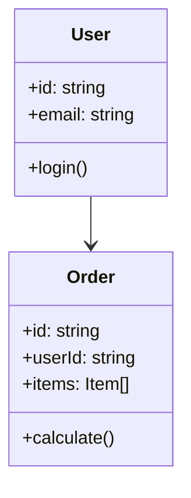

# Core Business Logic 문서 작성 가이드

## 핵심 원칙

비즈니스 크리티컬한 코드, 핵심 도메인 로직, 변경 빈도를 파악합니다.

## 분석 항목

1. **비즈니스 크리티컬 영역**: 결제, 인증, 핵심 도메인
2. **핵심 도메인 로직**: 엔티티, 서비스, 비즈니스 규칙
3. **변경 빈도**: Git 히스토리 기반 핫스팟 식별
4. **데이터 흐름**: 입력 → 처리 → 출력 경로

## 분석 방법

```bash
# 비즈니스 키워드
grep -ri "payment\|transaction\|auth\|order\|checkout" src/

# 도메인 파일
find src/ -name "*Service.js" -o -name "*Repository.ts"

# 변경 빈도 (Git)
git log --format=format: --name-only | grep -v '^$' | sort | uniq -c | sort -rn | head -20
```

## 문서 구조

````markdown
# 핵심 비즈니스 로직 분석

## 1. 비즈니스 크리티컬 파일

### 🔴 결제 관련

| 파일                      | 역할      | 위험도   |
| ------------------------- | --------- | -------- |
| `src/services/payment.ts` | 결제 처리 | Critical |
| `src/services/refund.ts`  | 환불 처리 | Critical |

### 🟠 인증 관련

| 파일                  | 역할        | 위험도 |
| --------------------- | ----------- | ------ |
| `src/auth/login.ts`   | 로그인 처리 | High   |
| `src/auth/session.ts` | 세션 관리   | High   |

### 🟡 주문 관련

| 파일                    | 역할      | 위험도 |
| ----------------------- | --------- | ------ |
| `src/services/order.ts` | 주문 처리 | Medium |

## 2. 핵심 도메인 모델


````

## 3. 변경 빈도 분석 (핫스팟)

### 높은 변경 빈도 (>50회)

| 파일                  | 변경 횟수 | 최근 변경 | 주의 |
| --------------------- | --------- | --------- | ---- |
| `src/utils/format.ts` | 87        | 2일 전    | 🔴   |

### 안정적인 파일 (<5회)

| 파일                     | 변경 횟수 | 최근 변경 |
| ------------------------ | --------- | --------- |
| `src/constants/index.ts` | 3         | 3개월 전  |

## 4. 데이터 흐름

```
User Input
    ↓
[Validation Layer]
    ↓
[Business Logic]
    ↓
[Data Access Layer]
    ↓
[External Services / DB]
```

## 5. 비즈니스 규칙 예시

### 결제 규칙

- 최소 결제 금액: 1,000원
- 1일 최대 결제 한도: 1,000,000원
- 결제 실패 시 3회 재시도

### 주문 규칙

- 최소 주문 수량: 1개
- 재고 확인 필수
- 결제 완료 후 주문 확정

```

```
