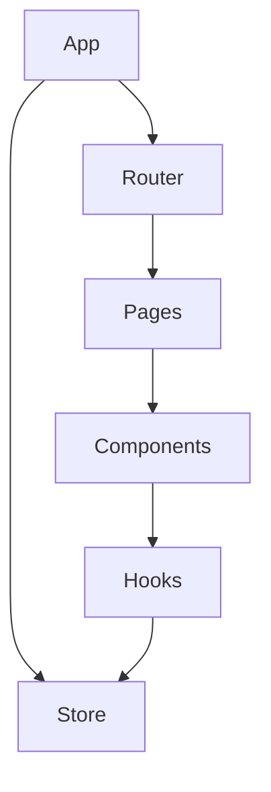

# Dependency Graph 문서 작성 가이드

## 핵심 원칙

내부 모듈 의존성, 순환 의존성, 외부 패키지 의존성을 분석합니다.

## 분석 항목

1. **내부 의존성**: import/require 추출, 의존 관계 매핑
2. **순환 의존성**: A → B → C → A 패턴 탐지
3. **외부 의존성**: package.json 분석, 보안 취약점 체크
4. **결합도**: 모듈별 의존도 측정, 허브 모듈 식별

## 분석 방법

```bash
# Import 추출
grep -r "^import\|^const.*require" src/ --include="*.js" --include="*.ts"

# 패키지 분석
npm outdated
npm audit --json
```

## 문서 구조

````markdown
# 의존성 분석

## 1. 내부 의존성 그래프


````

## 2. 순환 의존성

⚠️ 발견된 순환 의존성:

| 순환 경로 | 심각도 | 권장 해결방법   |
| --------- | ------ | --------------- |
| A → B → A | High   | 인터페이스 분리 |

## 3. 높은 결합도 모듈

> 의존성 10개 이상인 모듈

| 모듈             | 의존 수 | 피의존 수 | 총 결합도 |
| ---------------- | ------- | --------- | --------- |
| `utils/index.ts` | 15      | 30        | 45        |

## 4. 외부 패키지 상태

### 업데이트 필요

| 패키지 | 현재 버전 | 최신 버전 | 위험도 |
| ------ | --------- | --------- | ------ |
| lodash | 4.17.15   | 4.17.21   | Medium |

### 보안 취약점

| 패키지 | 취약점   | 심각도 | 권장 조치     |
| ------ | -------- | ------ | ------------- |
| axios  | CVE-XXXX | High   | 업데이트 필요 |

## 5. 권장 사항

1. 순환 의존성 해결 우선
2. 허브 모듈 분리 검토
3. 취약 패키지 업데이트

```

```
