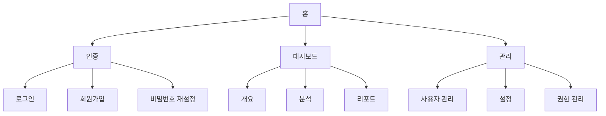

# 페이지 구조 정의

## 프로젝트 정보

- **프로젝트명**: [프로젝트명]
- **작성일**: [YYYY-MM-DD]
- **버전**: [v1.0.0]

## 사이트맵



## 라우팅 구조

```
/                           # 홈
├── /auth                   # 인증 관련
│   ├── /login             # 로그인
│   ├── /register          # 회원가입
│   └── /reset-password    # 비밀번호 재설정
├── /dashboard             # 대시보드
│   ├── /overview          # 개요
│   ├── /analytics         # 분석
│   └── /reports           # 리포트
└── /admin                 # 관리자
    ├── /users             # 사용자 관리
    ├── /settings          # 설정
    └── /permissions       # 권한 관리
```

## 접근 권한 매트릭스

| 페이지          | Guest | User | Admin |
| --------------- | ----- | ---- | ----- |
| 홈              | ✅    | ✅   | ✅    |
| 로그인/회원가입 | ✅    | ❌   | ❌    |
| 대시보드        | ❌    | ✅   | ✅    |
| 사용자 관리     | ❌    | ❌   | ✅    |
| 설정            | ❌    | ✅   | ✅    |

## 주요 페이지 정보

| 페이지   | 경로       | 접근 권한 | 주요 기능 |
| -------- | ---------- | --------- | --------- |
| 홈       | /          | Public    | [기능]    |
| 로그인   | /login     | Guest     | [기능]    |
| 대시보드 | /dashboard | User      | [기능]    |
