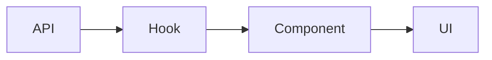

# Feature Plan 문서 구조 템플릿

````markdown
# Feature Plan: [기능 ID] [기능명]

> Research: `.claude/docs/research/[Feature ID]-research.md` 참조

## 1. 기술 설계

### 1.1 변경 사항 요약 (Before → After)

**파일: `path/to/file.ts`**

```typescript
// Before
기존 코드

// After
변경될 코드
```

### 1.2 인터페이스/타입 정의

```typescript
interface NewInterface {
  // ...
}
```

### 1.3 API 스펙

| Method | Endpoint | Request | Response       |
| ------ | -------- | ------- | -------------- |
| GET    | /api/xxx | -       | `ResponseType` |

### 1.4 데이터 흐름



### 1.5 컴포넌트 구조 (개요)

- `ComponentA`: 역할 설명
- `ComponentB`: 역할 설명

### 1.6 핵심 로직

```typescript
function coreLogic() {
  // 핵심 비즈니스 로직
}
```

### 1.7 테스트 설계

**Unit Test (핵심 비즈니스 로직)**

| 대상 함수/모듈 | 테스트 케이스                 | 파일             |
| -------------- | ----------------------------- | ---------------- |
| `함수명`       | 정상 케이스, 엣지 케이스 설명 | `파일명.test.ts` |

---

## 2. 리스크 & Critical Decisions

### 2.1 기술적 제약사항

- 제약 1
- 제약 2

### 2.2 리스크

- 🔴 [높은 위험]: 설명
- 🟡 [중간 위험]: 설명

### 2.3 Critical Decisions (의사결정 필요)

> 구현 전 확정이 필요한 사항

- [ ] **결정 1**: [질문]
  - 옵션 A: [설명]
  - 옵션 B: [설명]
  - 추천: [옵션] - [이유]

---

## 3. Implementation Plan

### 3.1 Implementation Groups

> 그룹화 원칙:
>
> - 논리적으로 관련된 작업들을 하나의 그룹으로 묶음
> - 각 그룹은 독립적으로 검증 가능해야 함
> - 그룹당 3-7개 정도의 task가 적절

**Group 1: [그룹명 - 예: 타입 및 인터페이스 정의]**

- Task: 기본 타입 정의 - `src/types/[기능명].ts`
- Task: API 인터페이스 정의 - `src/types/api.ts`
  **검증:** `npm run type-check` 통과

**Group 2: [그룹명 - 예: API 레이어 구현]**

- Task: API 클라이언트 함수 작성 - `src/api/[기능명].ts`
- Task: API 함수 Unit Test - `src/api/__tests__/[기능명].test.ts`
  **검증:** API 관련 테스트 통과

**Group 3: [그룹명 - 예: 비즈니스 로직 구현]**

- Task: 커스텀 훅 구현 - `src/hooks/use[기능명].ts`
- Task: 비즈니스 로직 Unit Test
  **검증:** 비즈니스 로직 테스트 통과

**Group 4: [그룹명 - 예: UI 컴포넌트 구현]**

- Task: 메인 컴포넌트 구현 - `src/components/[Component].tsx`
- Task: Component Test
  **검증:** 컴포넌트 테스트 통과

### 3.2 검증 방법

**자동 검증:**

- `npm test -- [테스트 경로]`
- `npm run lint`
- `npm run type-check`

**수동 검증:**

- [ ] 확인 항목 1
- [ ] 확인 항목 2
````
