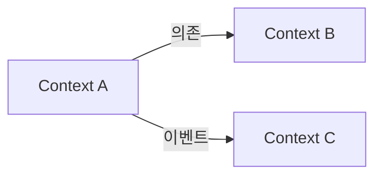

# Domain Definition 문서 작성 가이드

## 핵심 원칙

**"분석 결과를 바탕으로 도메인을 설계하고 구조화된 문서로 작성"**

## 분석 → 설계 매핑

| domain-research.md (분석) | domain-definition.md (설계)  |
| ------------------------- | ---------------------------- |
| 요구사항 요약             | 개요 / 비즈니스 목표         |
| 비즈니스 도메인 파악      | → **Bounded Contexts 설계**  |
| 관련 기존 코드            | → **엔티티/인터페이스 설계** |
| 기술적 제약사항           | 기술적 제약사항              |
| 추가 조사 필요 사항       | 미결 사항                    |

## 설계 항목

이 에이전트에서 설계해야 할 항목:

- **Bounded Contexts**: 비즈니스 도메인 파악 결과를 바탕으로 컨텍스트 경계 설계
- **엔티티/인터페이스**: 관련 기존 코드를 참고하여 핵심 엔티티 설계 (프로젝트 언어에 맞게 코드 블럭으로 작성)
- **비즈니스 규칙**: 요구사항과 도메인에서 도출
- **컨텍스트 관계도**: 도메인 간 관계를 시각화
- **도메인 용어집**: 분석 과정에서 발견된 용어 정리

## 클라이언트 인터페이스 규칙

- **포함**: 클라이언트에서 사용하는 도메인 엔티티, 타입
- **제외**: 백엔드 DTO (Request/Response 인터페이스)
- DTO 변환 레이어가 있는 경우 언급

## 작성 원칙

### 비즈니스 중심

- 기술보다 비즈니스 요구사항에 집중
- "어떻게"보다 "무엇을"에 집중

### 명확성

- 모호한 표현 배제
- 구체적인 예시 제공
- 용어 정의 명확히

### 구조화

- 계층적 구조 유지
- 일관된 포맷 사용
- 참조 가능한 ID/이름 부여

## 문서 구조

````markdown
# 도메인 정의

## 개요

[프로젝트의 도메인에 대한 간략한 설명]

### 비즈니스 목표

- [목표 1]
- [목표 2]

---

## Bounded Contexts

### [컨텍스트명 1]

**책임**: [이 컨텍스트의 주요 책임]

#### 핵심 엔티티

> 클라이언트 인터페이스만 작성 (백엔드 DTO 제외)

```typescript
interface User {
  id: string;
  email: string;
  name: string;
  role: UserRole;
  createdAt: Date;
}

type UserRole = "admin" | "member" | "guest";
```

#### 비즈니스 규칙

- [규칙 1]
- [규칙 2]

### [컨텍스트명 2]

...

---

## 컨텍스트 관계도



---

## 기술적 제약사항

- [제약사항 1]
- [제약사항 2]

---

## 설계 원칙

- [원칙 1]
- [원칙 2]

---

## 도메인 용어집

| 용어    | 정의   | 컨텍스트        |
| ------- | ------ | --------------- |
| [용어1] | [정의] | [해당 컨텍스트] |

---

## 미결 사항

- [ ] [추가 조사 필요 사항 1]
- [ ] [추가 조사 필요 사항 2]
````
