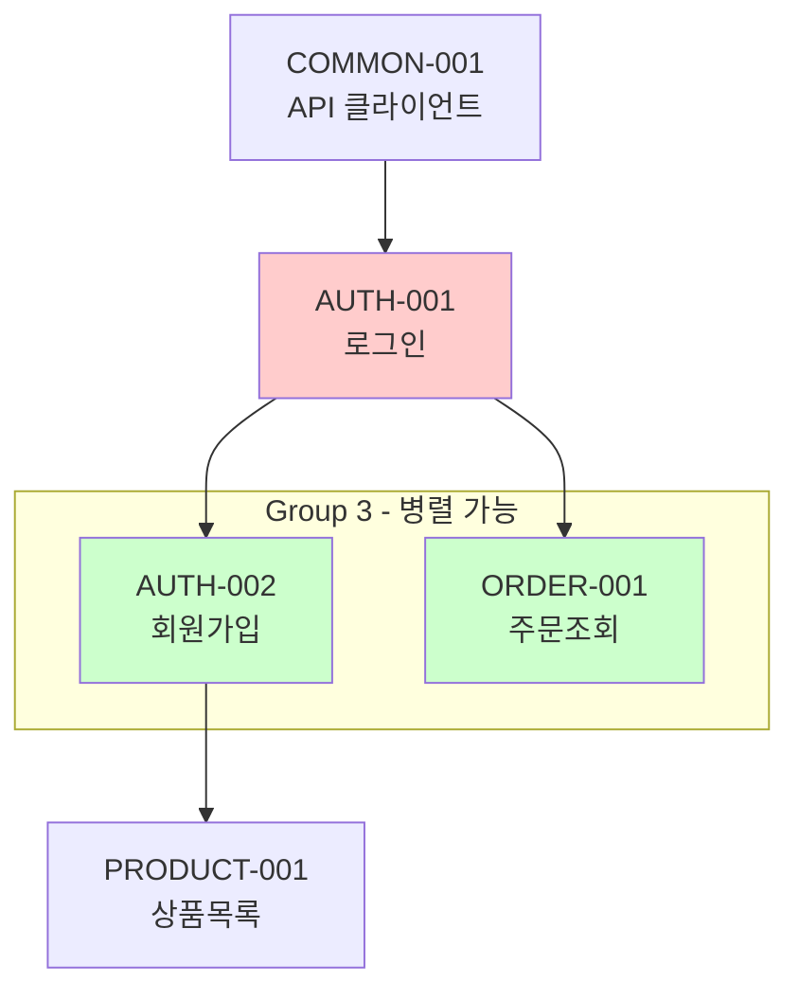

# Feature List 문서 작성 가이드

## 핵심 원칙

**"완결된 기능 단위의 Feature + 개별 작업 단위의 Task"**

- **Feature**: 하나의 목적을 달성하는 완결된 기능 (로그인, 상품 목록 등)
- **Task**: 개별 작업 단위 (API 하나, 컴포넌트 하나, 훅 하나)

## Feature 분류 기준

### 적절한 Feature 크기

| 기준       | 설명                                           |
| ---------- | ---------------------------------------------- |
| **완결성** | 하나의 목적을 달성하는 완결된 기능             |
| **범위**   | 관련 작업이 모두 포함 (타입 + API + 상태 + UI) |
| **명확성** | 기능명만으로 무엇을 하는지 이해 가능           |
| **단일성** | 하나의 동작만 포함 (조회/수정 분리)            |

### Feature 세분화 원칙

**핵심: 복합 동작은 분리한다**

| 복합 기능           | 분리 후                           |
| ------------------- | --------------------------------- |
| 회원 정보 조회/수정 | 회원 정보 조회 + 회원 정보 수정   |
| 상품 등록/수정/삭제 | 상품 등록 + 상품 수정 + 상품 삭제 |
| 주문 생성/취소      | 주문 생성 + 주문 취소             |

### Feature당 Task 개수

- **권장**: 1~3개 Task
- **최대**: 4개 Task
- **4개 초과 시**: Feature 분리 검토

### 분류 예시

```
❌ 너무 작음 (레이어별 분리)
AUTH-001 인증 타입 정의
AUTH-002 인증 API 연동

❌ 복합 기능 (분리 필요)
PASSER-001 회원 정보 조회/수정

✅ 적절함 (단일 동작의 완결된 기능)
AUTH-001 로그인 기능
AUTH-002 회원가입 기능
PASSER-001 회원 정보 조회
PASSER-002 회원 정보 수정

❌ 너무 큼
AUTH-001 사용자 인증 전체 (로그인 + 회원가입 + ...)
```

## ID 명명 규칙

- **Feature ID**: `{도메인}-{3자리 숫자}` (예: AUTH-001)
- **Task ID**: `{Feature ID}-{3자리 숫자}` (예: AUTH-001-001)

## 우선순위 할당

- **high**: 핵심 기능, 다른 Task의 선행 조건
- **medium**: 주요 기능, 일반적인 구현
- **low**: 부가 기능, 선택적 구현

## 주의사항

- **상세 문서는 작성하지 않음** (feature-detail-writer가 담당)
- 사용자 검토를 위한 **간략한 리스트**만 생성
- Feature/Task 분류의 **적절성**에 집중

## 문서 구조

````markdown
# Feature 목록

## 개요

[프로젝트의 주요 기능에 대한 간략한 설명]

- **총 Feature 수**: N개
- **총 Task 수**: N개
- **도메인 수**: N개

---

## Feature 요약

### AUTH: 인증 (N features, N tasks)

| ID       | Feature명     | 설명                     | Tasks | 우선순위 |
| -------- | ------------- | ------------------------ | ----- | -------- |
| AUTH-001 | 로그인 기능   | 사용자 인증 및 세션 관리 | 4     | High     |
| AUTH-002 | 회원가입 기능 | 신규 사용자 등록         | 5     | High     |

---

## Feature 의존성



---

## 구현 순서 가이드

> **같은 Group 내 Feature는 `/workflow-implement-parallel`로 병렬 작업 가능합니다.**

### Group의 핵심 정의

**Group = 동시에 병렬 작업이 가능한 Feature들의 집합**

- Group 내 모든 Feature는 **Git Worktree를 통해 동시 작업** 가능해야 함
- Group 내 Feature들 사이에 **순차 의존성이 없어야** 함
- Group 내 Feature가 1개뿐이면 **단독 Group**

### Group 분류 기준

**필수 조건** (모두 만족해야 같은 Group):

1. **동일 선행 조건**: 모든 Feature가 같은 Group 완료 후 시작 가능
2. **상호 독립**: Feature 간 의존성 없음 (A→B 관계 없음)
3. **충돌 회피**: 같은 파일/컴포넌트를 수정하지 않음

**⚠️ 주의**: 아래 경우는 반드시 **다른 Group으로 분리**:

| 다른 Group으로 분리해야 하는 경우           | 이유                            |
| ------------------------------------------- | ------------------------------- |
| A가 B의 선행 조건 (A→B)                     | 순차 의존성 존재                |
| A와 B가 같은 컴포넌트/패널 수정             | 충돌 발생                       |
| A와 B가 같은 도메인 + 같은 자원 유형        | 충돌 가능성 높음                |
| 예: API 기반 → 타입 정의 (순차)             | 타입이 API에 의존               |
| 예: 상세조회 → 상태변경 (같은 패널 내 액션) | 상태변경이 상세조회 패널에 의존 |
| 예: 로그인 → 회원가입 (같은 auth 자원)      | 같은 인증 모듈 수정             |

**✅ 같은 Group으로 묶을 수 있는 경우**:

| 같은 Group 가능                            | 이유                          |
| ------------------------------------------ | ----------------------------- |
| 서로 다른 도메인의 진입점 페이지           | 완전히 독립적                 |
| 같은 페이지의 서로 다른 섹션 (테이블/필터) | 다른 컴포넌트 파일            |
| 예: URM-001(테이블) + URM-002(필터)        | 같은 페이지지만 다른 컴포넌트 |
| 예: 주문조회 + 상품목록 (다른 도메인)      | 완전히 독립적                 |

### 예시: 올바른 Group 분류

```
의존성 그래프:
CMN-001 → CMN-002 → URM-001 → URM-004 → URM-007 → URM-008
                 ↘           ↘         ↘
                  URM-002     URM-005    URM-009
                           ↘
                            URM-006

         CMN-002 → FCM-001 → FCM-003 → FCM-004
                 ↘
                  FCM-002

         CMN-002 → TPL-001 → TPL-002
                          ↘
                           TPL-003

올바른 Group 분류:
- Group 1: CMN-001 (단독 - 시작점)
- Group 2: CMN-002 (단독 - CMN-001에 의존)
- Group 3: URM-001, URM-002, FCM-001, FCM-002, TPL-001 (모두 CMN-002에만 의존, 서로 독립)
- Group 4: URM-004, URM-005, URM-006 (모두 URM-001에만 의존)
- Group 5: FCM-003, TPL-002, TPL-003 (각각 선행 조건만 의존, 서로 다른 도메인)
- Group 6: URM-007, FCM-004 (각각 선행 조건만 의존, 서로 다른 도메인)
- Group 7: URM-008, URM-009 (모두 URM-007에만 의존, 다른 컴포넌트)

❌ 잘못된 예시:
- Group X: CMN-001, CMN-002  ← CMN-002가 CMN-001에 의존하므로 순차 필요!
- Group Y: URM-007, URM-008  ← URM-008이 URM-007에 의존하므로 순차 필요!
```

### 구현 순서 테이블 (예시)

| Group | Features                         | 선행 조건    | 병렬 가능 근거   |
| ----- | -------------------------------- | ------------ | ---------------- |
| 1     | COMMON-001                       | -            | 단독 (시작점)    |
| 2     | COMMON-002                       | Group 1 완료 | 단독 (순차 의존) |
| 3     | AUTH-001, ORDER-001, PRODUCT-001 | Group 2 완료 | 서로 다른 도메인 |
| 4     | AUTH-002, ORDER-002              | Group 3 완료 | 서로 다른 도메인 |

> ⚠️ AUTH-001과 AUTH-002는 같은 auth 자원을 수정하므로 분리

---

## Task 상세

### AUTH-001: 로그인 기능

| Task ID      | Task명             | 우선순위 | 의존성       |
| ------------ | ------------------ | -------- | ------------ |
| AUTH-001-001 | 인증 타입 정의     | High     | -            |
| AUTH-001-002 | 로그인 API 함수    | High     | AUTH-001-001 |
| AUTH-001-003 | useAuth 훅         | High     | AUTH-001-002 |
| AUTH-001-004 | 로그인 폼 컴포넌트 | Medium   | AUTH-001-003 |
````
