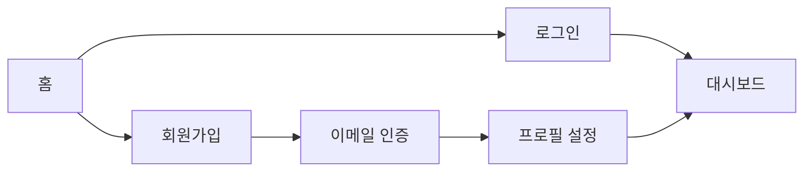

# Page Structure 문서 작성 가이드

## 핵심 원칙

**"분석 결과를 바탕으로 사용자 중심의 페이지 흐름을 설계"**

## 설계 원칙

### 라우팅 설계

- RESTful 원칙 준수
- 계층 구조 명확히
- URL 네이밍 일관성

### 페이지별 책임 정의

- 각 페이지의 주요 목적 명시
- 하나의 페이지는 하나의 주요 작업에 집중
- 페이지 간 데이터 흐름 고려

### 접근 권한

- 페이지별 필요 권한 수준 명시
- 인증/인가 요구사항 정리

### 네비게이션 설계

- 사용자 플로우 고려
- 메인 네비게이션 구조
- 페이지 간 이동 경로

## 작성 원칙

### 사용자 중심

- 사용자의 작업 흐름을 우선 고려
- 직관적인 페이지 구조
- 최소 클릭으로 목표 달성

### 명확성

- 각 페이지의 목적 명확히
- URL 구조 직관적으로
- 네비게이션 일관성 유지

### 확장성

- 향후 기능 추가 고려
- 유연한 라우팅 구조
- 모듈화된 페이지 구성

## 문서 구조

````markdown
# 페이지 구조

## 개요

[페이지 구조에 대한 간략한 설명]

## 라우팅 구조

### 공개 페이지

| 경로      | 페이지명 | 설명             | 권한 |
| --------- | -------- | ---------------- | ---- |
| `/`       | 홈       | 메인 랜딩 페이지 | 공개 |
| `/login`  | 로그인   | 사용자 로그인    | 공개 |
| `/signup` | 회원가입 | 신규 사용자 등록 | 공개 |

### 인증 필요 페이지

| 경로         | 페이지명 | 설명               | 권한 |
| ------------ | -------- | ------------------ | ---- |
| `/dashboard` | 대시보드 | 사용자 대시보드    | 인증 |
| `/profile`   | 프로필   | 사용자 프로필 관리 | 인증 |

### 관리자 페이지

| 경로     | 페이지명        | 설명            | 권한   |
| -------- | --------------- | --------------- | ------ |
| `/admin` | 관리자 대시보드 | 관리자 대시보드 | 관리자 |

## 페이지별 상세

### `/` - 홈

**목적**: [페이지의 주요 목적]

**주요 기능**:

- [기능 1]
- [기능 2]

**관련 기능 ID**:

- [기능ID-1]
- [기능ID-2]

**네비게이션**:

- → [다음 페이지]: [조건/액션]

## 네비게이션 플로우



## 접근 권한 매트릭스

| 권한 레벨 | 접근 가능 페이지 |
|-----------|------------------|
| 공개 | `/`, `/login`, `/signup` |
| 인증 | 공개 + `/dashboard`, `/profile` |
| 관리자 | 인증 + `/admin/*` |

## 레이아웃 구조

### 공개 레이아웃
- 헤더: 로고, 로그인/회원가입 버튼
- 푸터: 저작권, 링크

### 인증 레이아웃
- 헤더: 로고, 네비게이션 메뉴, 사용자 메뉴
- 사이드바: 주요 메뉴
- 푸터: 저작권, 링크

### 관리자 레이아웃
- 헤더: 로고, 관리 메뉴
- 사이드바: 관리 기능 메뉴
- 푸터: 시스템 정보
````
