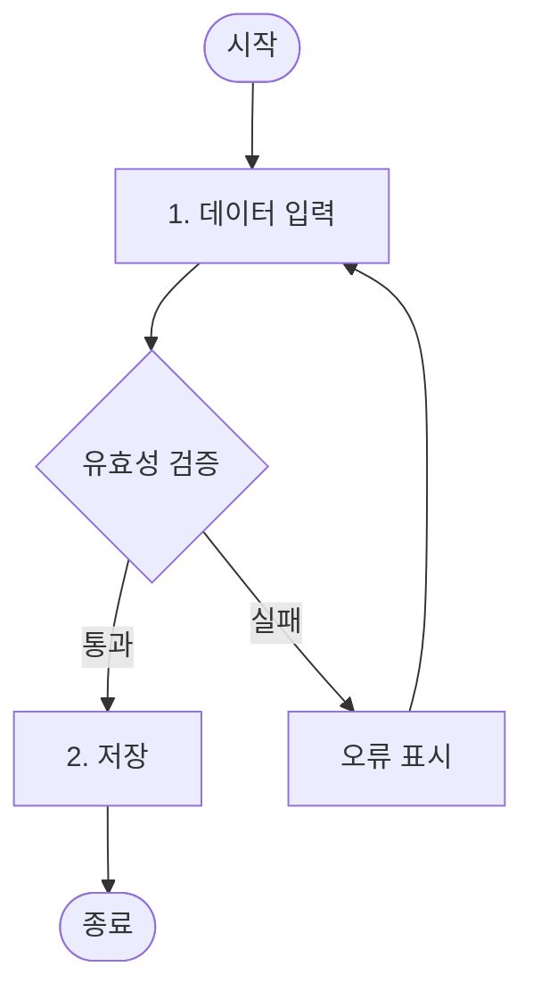
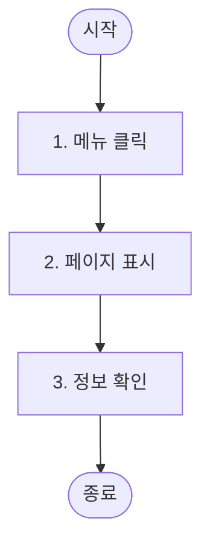
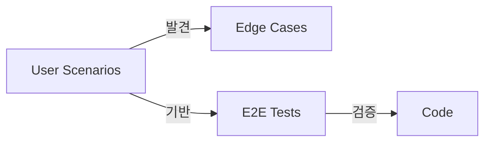

# User Scenarios 문서 작성 가이드

## 핵심 원칙

**"설계 검증과 엣지 케이스 발견을 위한 사용자 관점의 흐름 정리"**

- Feature 분류의 기준이 아님 (Feature는 기존 기준 유지)
- 설계 완성도 검증용 보조 문서
- E2E 테스트 시나리오 기반

## 목적

1. **엣지 케이스 발견**: 놓친 예외 상황 식별
2. **E2E 테스트 기반**: 테스트 시나리오로 재활용
3. **팀 커뮤니케이션**: 비개발자도 이해할 수 있는 흐름 문서

## 작성 원칙

### 사용자 관점

- 기술 용어 최소화
- 실제 사용자 행동 중심
- "~한다" 형태의 행동 기술

### 완결성

- 시작부터 끝까지 완전한 흐름
- 성공/실패 케이스 모두 포함
- 대안 흐름 명시

### 검증 가능

- E2E 테스트로 검증 가능한 형태
- 누락된 엣지 케이스 식별

## ID 명명 규칙

- **시나리오 ID**: `US-{3자리 숫자}` (예: US-001, US-002)
- 도메인별로 그룹화하되, ID는 전체에서 순차 부여
- 대안/예외 흐름은 기본 흐름 단계 번호 + 알파벳 (예: 3a, 4b)

## 시나리오 분류 기준

- **도메인별 그룹화**: 인증, 주문, 상품 등 Feature 도메인과 동일하게 분류
- **Actor별 정리**: 같은 Actor의 주요 흐름을 연속으로 배치
- **권장 개수**: 핵심 시나리오 5~15개 (프로젝트 규모에 따라 조정)

## 문서 구조

`templates/user-scenarios.md` 참조

## 시나리오 작성 팁

### 기본 흐름

- 가장 일반적인 성공 케이스
- 단계별로 번호 매기기
- 주어 명시 ("사용자가 ~한다")
- **1개 이상의 조건 분기 포함** (단순 순차 흐름 지양)

### 대안 흐름

- 정상적이지만 다른 경로
- 기본 흐름의 어느 단계에서 분기하는지 명시 (예: 3a)
- **최소 2개 이상의 대안 경로 식별**

### 예외 흐름

- 오류 상황
- 시스템 장애, 네트워크 오류 등
- **최소 1개 이상 포함**

## ⚠️ 흐름 다양성

> **안티패턴**: 모든 시나리오가 `a→b→c→d` 형태의 단순 직선 흐름만 존재

### 시나리오 유형별 적절한 흐름

| 시나리오 유형        | 분기 필요 여부 | 예시                 |
| -------------------- | -------------- | -------------------- |
| **단순 조회**        | ❌ 불필요      | 정보 확인, 목록 조회 |
| **데이터 입력/수정** | ✅ 필요        | 유효성 검증 분기     |
| **다단계 프로세스**  | ✅ 필요        | 취소, 이전 단계 복귀 |

### 문서 전체 기준

전체 시나리오 중 다음 패턴들이 **적절히 분포**되어야 함:

| 패턴     | 설명                  | 적용 대상          |
| -------- | --------------------- | ------------------ |
| **분기** | 조건에 따른 다른 경로 | 입력/수정 시나리오 |
| **루프** | 조건 충족까지 반복    | 재시도, 재입력     |
| **중단** | 흐름 중간 이탈        | 다단계 프로세스    |

### Mermaid 예시

**분기가 있는 시나리오** (입력/수정):

**분기가 없는 시나리오** (단순 조회):

> 💡 단순 조회 시나리오에 억지로 분기를 넣지 않아도 됨

## 활용 관계

