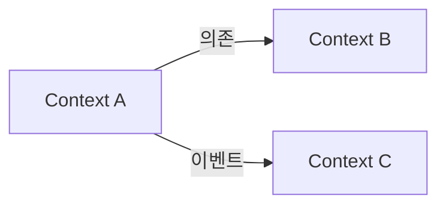

# Domain Definition 문서 구조 템플릿

```markdown
# 도메인 정의

## 개요

[프로젝트의 도메인에 대한 간략한 설명]

### 비즈니스 목표

- [목표 1]
- [목표 2]

---

## Bounded Contexts

### [컨텍스트명 1]

**책임**: [이 컨텍스트의 주요 책임]

#### 핵심 엔티티

> 클라이언트 인터페이스만 작성 (백엔드 DTO 제외)

```typescript
interface User {
  id: string;
  email: string;
  name: string;
  role: UserRole;
  createdAt: Date;
}

type UserRole = "admin" | "member" | "guest";
```

#### 비즈니스 규칙

- [규칙 1]
- [규칙 2]

### [컨텍스트명 2]

...

---

## 컨텍스트 관계도



---

## 기술적 제약사항

- [제약사항 1]
- [제약사항 2]

---

## 설계 원칙

- [원칙 1]
- [원칙 2]

---

## 도메인 용어집

| 용어    | 정의   | 컨텍스트        |
| ------- | ------ | --------------- |
| [용어1] | [정의] | [해당 컨텍스트] |

---

## 미결 사항

- [ ] [추가 조사 필요 사항 1]
- [ ] [추가 조사 필요 사항 2]
```
