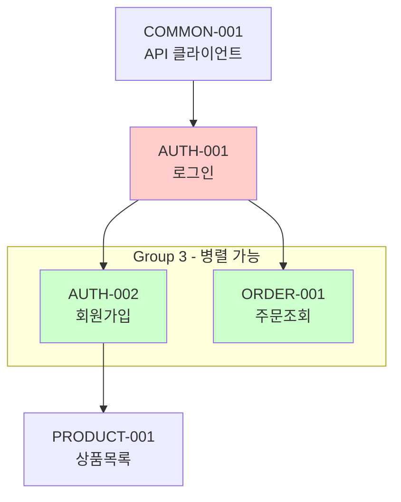

# Feature List 문서 구조 템플릿

````markdown
# Feature 목록

## 개요

[프로젝트의 주요 기능에 대한 간략한 설명]

- **총 Feature 수**: N개
- **총 Task 수**: N개
- **도메인 수**: N개

---

## Feature 요약

### AUTH: 인증 (N features, N tasks)

| ID       | Feature명     | 설명                     | Tasks | 우선순위 |
| -------- | ------------- | ------------------------ | ----- | -------- |
| AUTH-001 | 로그인 기능   | 사용자 인증 및 세션 관리 | 4     | High     |
| AUTH-002 | 회원가입 기능 | 신규 사용자 등록         | 5     | High     |

---

## Feature 의존성



---

## 구현 순서 가이드

> **같은 Group 내 Feature는 `/workflow-implement-parallel`로 병렬 작업 가능합니다.**

### 구현 순서 테이블

| Group | Features                         | 선행 조건    | 병렬 가능 근거   |
| ----- | -------------------------------- | ------------ | ---------------- |
| 1     | COMMON-001                       | -            | 단독 (시작점)    |
| 2     | COMMON-002                       | Group 1 완료 | 단독 (순차 의존) |
| 3     | AUTH-001, ORDER-001, PRODUCT-001 | Group 2 완료 | 서로 다른 도메인 |
| 4     | AUTH-002, ORDER-002              | Group 3 완료 | 서로 다른 도메인 |

---

## Task 상세

### AUTH-001: 로그인 기능

| Task ID      | Task명             | 우선순위 | 의존성       |
| ------------ | ------------------ | -------- | ------------ |
| AUTH-001-001 | 인증 타입 정의     | High     | -            |
| AUTH-001-002 | 로그인 API 함수    | High     | AUTH-001-001 |
| AUTH-001-003 | useAuth 훅         | High     | AUTH-001-002 |
| AUTH-001-004 | 로그인 폼 컴포넌트 | Medium   | AUTH-001-003 |
````
