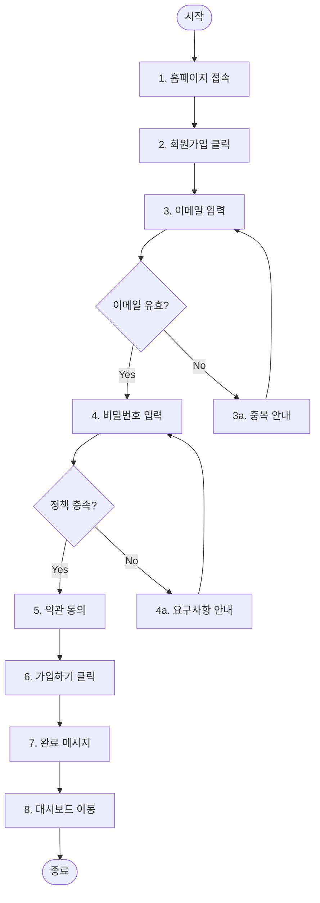

# User Scenarios 문서 구조 템플릿

````markdown
# 유저 시나리오

## 개요

[시나리오 문서의 목적과 범위]

- **총 시나리오 수**: N개
- **주요 Actor**: [사용자 유형 나열]

---

## Actor 정의

| Actor    | 설명                    | 주요 목표          |
| -------- | ----------------------- | ------------------ |
| 비회원   | 가입하지 않은 방문자    | 서비스 탐색, 가입  |
| 일반회원 | 가입 완료한 사용자      | 서비스 이용        |
| 관리자   | 시스템 관리 권한 보유자 | 사용자/콘텐츠 관리 |

---

## 시나리오 목록

### 인증 관련

| ID     | 시나리오명      | Actor  |
| ------ | --------------- | ------ |
| US-001 | 신규 회원가입   | 비회원 |
| US-002 | 로그인          | 비회원 |
| US-003 | 비밀번호 재설정 | 회원   |

---

## 시나리오 상세

### US-001: 신규 회원가입

**Actor**: 비회원
**Goal**: 서비스에 가입하여 기능을 이용

**사전 조건**

- 사용자가 서비스에 가입되어 있지 않음

**기본 흐름**

1. 홈페이지에 접속한다
2. "회원가입" 버튼을 클릭한다
3. 이메일 주소를 입력한다
4. 비밀번호를 입력한다
5. 이용약관에 동의한다
6. "가입하기" 버튼을 클릭한다
7. 가입 완료 메시지를 확인한다
8. 대시보드로 이동한다



**대안 흐름**

- **3a. 이미 가입된 이메일**

  1. "이미 가입된 이메일입니다" 메시지 표시
  2. 로그인 페이지 링크 제공

- **4a. 비밀번호 정책 미충족**

  1. 비밀번호 요구사항 안내 표시
  2. 재입력 요청

- **5a. 필수 약관 미동의**
  1. "필수 약관에 동의해주세요" 메시지 표시
  2. 진행 불가

**예외 흐름**

- **E1. 네트워크 오류**
  1. "네트워크 오류가 발생했습니다" 메시지 표시
  2. 재시도 버튼 제공

**사후 조건**

- 사용자 계정이 생성됨
- 사용자가 로그인 상태가 됨

**발견된 추가 고려사항**

- [ ] 이메일 인증 단계 필요 여부 검토
- [ ] 소셜 로그인 대안 흐름 추가 필요

---

### US-002: 로그인

(동일한 형식으로 작성)
````
