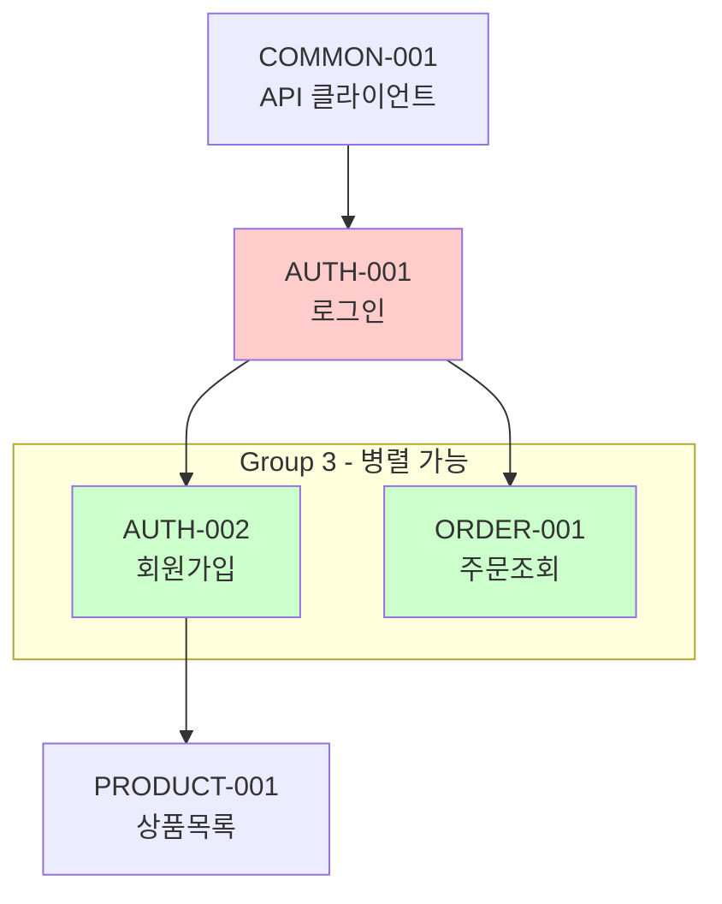

# Feature List 문서 작성 가이드

## 핵심 원칙

**"완결된 기능 단위의 Feature + 개별 작업 단위의 Task"**

- **Feature**: 하나의 목적을 달성하는 완결된 기능 (로그인, 상품 목록 등)
- **Task**: 개별 작업 단위 (API 하나, 컴포넌트 하나, 훅 하나)

## Feature 분류 기준

### 적절한 Feature 크기

| 기준       | 설명                                           |
| ---------- | ---------------------------------------------- |
| **완결성** | 하나의 목적을 달성하는 완결된 기능             |
| **범위**   | 관련 작업이 모두 포함 (타입 + API + 상태 + UI) |
| **명확성** | 기능명만으로 무엇을 하는지 이해 가능           |
| **단일성** | 하나의 동작만 포함 (조회/수정 분리)            |

### Feature 세분화 원칙

**핵심: 복합 동작은 분리한다**

| 복합 기능           | 분리 후                           |
| ------------------- | --------------------------------- |
| 회원 정보 조회/수정 | 회원 정보 조회 + 회원 정보 수정   |
| 상품 등록/수정/삭제 | 상품 등록 + 상품 수정 + 상품 삭제 |
| 주문 생성/취소      | 주문 생성 + 주문 취소             |

### Feature당 Task 개수

- **권장**: 1~3개 Task
- **최대**: 4개 Task
- **4개 초과 시**: Feature 분리 검토

### 분류 예시

```
❌ 너무 작음 (레이어별 분리)
AUTH-001 인증 타입 정의
AUTH-002 인증 API 연동

❌ 복합 기능 (분리 필요)
PASSER-001 회원 정보 조회/수정

✅ 적절함 (단일 동작의 완결된 기능)
AUTH-001 로그인 기능
AUTH-002 회원가입 기능
PASSER-001 회원 정보 조회
PASSER-002 회원 정보 수정

❌ 너무 큼
AUTH-001 사용자 인증 전체 (로그인 + 회원가입 + ...)
```

## ID 명명 규칙

- **Feature ID**: `{도메인}-{3자리 숫자}` (예: AUTH-001)
- **Task ID**: `{Feature ID}-{3자리 숫자}` (예: AUTH-001-001)

## 우선순위 할당

- **high**: 핵심 기능, 다른 Task의 선행 조건
- **medium**: 주요 기능, 일반적인 구현
- **low**: 부가 기능, 선택적 구현

## 주의사항

- **상세 문서는 작성하지 않음** (feature-detail-writer가 담당)
- 사용자 검토를 위한 **간략한 리스트**만 생성
- Feature/Task 분류의 **적절성**에 집중

## 문서 구조

````markdown
# Feature 목록

## 개요

[프로젝트의 주요 기능에 대한 간략한 설명]

- **총 Feature 수**: N개
- **총 Task 수**: N개
- **도메인 수**: N개

---

## Feature 요약

### AUTH: 인증 (N features, N tasks)

| ID       | Feature명     | 설명                     | Tasks | 우선순위 |
| -------- | ------------- | ------------------------ | ----- | -------- |
| AUTH-001 | 로그인 기능   | 사용자 인증 및 세션 관리 | 4     | High     |
| AUTH-002 | 회원가입 기능 | 신규 사용자 등록         | 5     | High     |

---

## Feature 의존성



---

## 구현 순서 가이드

> 같은 Group 내 Feature는 `/workflow-implement-parallel`로 병렬 작업 가능합니다.

### Group 분류 기준

**필수 조건** (모두 만족해야 같은 Group):

1. **의존성 조건**: 선행 Feature가 동일
2. **충돌 회피 조건**: 같은 파일/모듈을 수정할 가능성이 낮음

| 분리 필요 (다른 Group)       | 병합 가능 (같은 Group)  |
| ---------------------------- | ----------------------- |
| 같은 도메인 + 같은 자원 유형 | 다른 도메인             |
| 예: 로그인 ↔ 회원가입        | 예: 주문조회 ↔ 상품목록 |

### 구현 순서 테이블

| Group          | 우선순위 | Features            | 선행 조건    |
| -------------- | -------- | ------------------- | ------------ |
| 1. 기반 구축   | High     | COMMON-001          | -            |
| 2. 인증-로그인 | High     | AUTH-001            | Group 1 완료 |
| 3. 인증-가입   | High     | AUTH-002, ORDER-001 | Group 2 완료 |
| 4. 핵심 기능   | High     | PRODUCT-001         | Group 3 완료 |

> ⚠️ AUTH-001과 AUTH-002는 같은 auth 자원을 수정하므로 분리

---

## Task 상세

### AUTH-001: 로그인 기능

| Task ID      | Task명             | 우선순위 | 의존성       |
| ------------ | ------------------ | -------- | ------------ |
| AUTH-001-001 | 인증 타입 정의     | High     | -            |
| AUTH-001-002 | 로그인 API 함수    | High     | AUTH-001-001 |
| AUTH-001-003 | useAuth 훅         | High     | AUTH-001-002 |
| AUTH-001-004 | 로그인 폼 컴포넌트 | Medium   | AUTH-001-003 |
````
