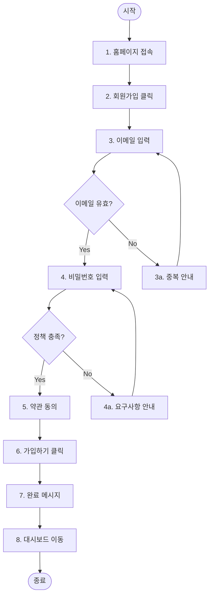
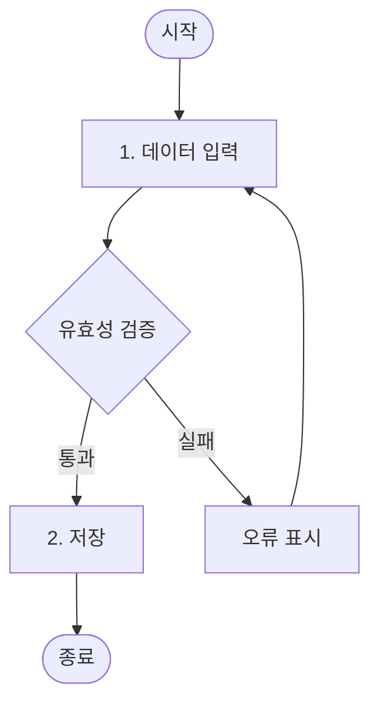
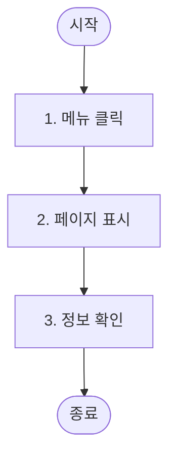
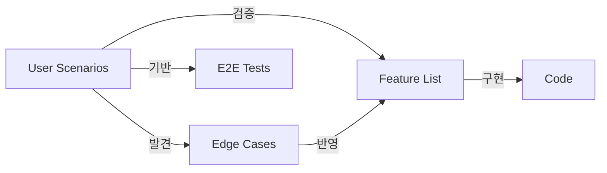

# User Scenarios 문서 작성 가이드

## 핵심 원칙

**"설계 검증과 엣지 케이스 발견을 위한 사용자 관점의 흐름 정리"**

- Feature 분류의 기준이 아님 (Feature는 기존 기준 유지)
- 설계 완성도 검증용 보조 문서
- E2E 테스트 시나리오 기반

## 목적

1. **설계 검증**: 현재 Feature들이 사용자 흐름을 모두 커버하는지 확인
2. **엣지 케이스 발견**: 놓친 예외 상황 식별
3. **E2E 테스트 기반**: 테스트 시나리오로 재활용
4. **팀 커뮤니케이션**: 비개발자도 이해할 수 있는 흐름 문서

## 작성 원칙

### 사용자 관점

- 기술 용어 최소화
- 실제 사용자 행동 중심
- "~한다" 형태의 행동 기술

### 완결성

- 시작부터 끝까지 완전한 흐름
- 성공/실패 케이스 모두 포함
- 대안 흐름 명시

### 검증 가능

- 각 시나리오가 어떤 Feature로 커버되는지 매핑
- 누락된 부분 식별

## ID 명명 규칙

- **시나리오 ID**: `US-{3자리 숫자}` (예: US-001, US-002)
- 도메인별로 그룹화하되, ID는 전체에서 순차 부여
- 대안/예외 흐름은 기본 흐름 단계 번호 + 알파벳 (예: 3a, 4b)

## 시나리오 분류 기준

- **도메인별 그룹화**: 인증, 주문, 상품 등 Feature 도메인과 동일하게 분류
- **Actor별 정리**: 같은 Actor의 주요 흐름을 연속으로 배치
- **권장 개수**: 핵심 시나리오 5~15개 (프로젝트 규모에 따라 조정)

## 문서 구조

````markdown
# 유저 시나리오

## 개요

[시나리오 문서의 목적과 범위]

- **총 시나리오 수**: N개
- **주요 Actor**: [사용자 유형 나열]

---

## Actor 정의

| Actor    | 설명                    | 주요 목표          |
| -------- | ----------------------- | ------------------ |
| 비회원   | 가입하지 않은 방문자    | 서비스 탐색, 가입  |
| 일반회원 | 가입 완료한 사용자      | 서비스 이용        |
| 관리자   | 시스템 관리 권한 보유자 | 사용자/콘텐츠 관리 |

---

## 시나리오 목록

### 인증 관련

| ID     | 시나리오명      | Actor  | 관련 Feature |
| ------ | --------------- | ------ | ------------ |
| US-001 | 신규 회원가입   | 비회원 | AUTH-002     |
| US-002 | 로그인          | 비회원 | AUTH-001     |
| US-003 | 비밀번호 재설정 | 회원   | AUTH-003     |

---

## 시나리오 상세

### US-001: 신규 회원가입

**Actor**: 비회원
**Goal**: 서비스에 가입하여 기능을 이용

**사전 조건**

- 사용자가 서비스에 가입되어 있지 않음

**기본 흐름**

1. 홈페이지에 접속한다
2. "회원가입" 버튼을 클릭한다
3. 이메일 주소를 입력한다
4. 비밀번호를 입력한다
5. 이용약관에 동의한다
6. "가입하기" 버튼을 클릭한다
7. 가입 완료 메시지를 확인한다
8. 대시보드로 이동한다



**대안 흐름**

- **3a. 이미 가입된 이메일**

  1. "이미 가입된 이메일입니다" 메시지 표시
  2. 로그인 페이지 링크 제공

- **4a. 비밀번호 정책 미충족**

  1. 비밀번호 요구사항 안내 표시
  2. 재입력 요청

- **5a. 필수 약관 미동의**
  1. "필수 약관에 동의해주세요" 메시지 표시
  2. 진행 불가

**예외 흐름**

- **E1. 네트워크 오류**
  1. "네트워크 오류가 발생했습니다" 메시지 표시
  2. 재시도 버튼 제공

**사후 조건**

- 사용자 계정이 생성됨
- 사용자가 로그인 상태가 됨

**Feature 매핑**

| 단계 | 관련 Feature | 커버 여부 |
| ---- | ------------ | --------- |
| 2~6  | AUTH-002     | ✅        |
| 8    | DASH-001     | ✅        |

**발견된 추가 고려사항**

- [ ] 이메일 인증 단계 필요 여부 검토
- [ ] 소셜 로그인 대안 흐름 추가 필요

---

### US-002: 로그인

(동일한 형식으로 작성)

---

## 커버리지 검증

### Feature별 시나리오 매핑

| Feature  | 관련 시나리오 | 커버리지 |
| -------- | ------------- | -------- |
| AUTH-001 | US-002        | ✅       |
| AUTH-002 | US-001        | ✅       |
| AUTH-003 | US-003        | ✅       |

### 미커버 영역

- [ ] [발견된 미커버 영역 1]
- [ ] [발견된 미커버 영역 2]
````

## 시나리오 작성 팁

### 기본 흐름

- 가장 일반적인 성공 케이스
- 단계별로 번호 매기기
- 주어 명시 ("사용자가 ~한다")
- **1개 이상의 조건 분기 포함** (단순 순차 흐름 지양)

### 대안 흐름

- 정상적이지만 다른 경로
- 기본 흐름의 어느 단계에서 분기하는지 명시 (예: 3a)
- **최소 2개 이상의 대안 경로 식별**

### 예외 흐름

- 오류 상황
- 시스템 장애, 네트워크 오류 등
- **최소 1개 이상 포함**

## ⚠️ 흐름 다양성

> **안티패턴**: 모든 시나리오가 `a→b→c→d` 형태의 단순 직선 흐름만 존재

### 시나리오 유형별 적절한 흐름

| 시나리오 유형        | 분기 필요 여부 | 예시                 |
| -------------------- | -------------- | -------------------- |
| **단순 조회**        | ❌ 불필요      | 정보 확인, 목록 조회 |
| **데이터 입력/수정** | ✅ 필요        | 유효성 검증 분기     |
| **다단계 프로세스**  | ✅ 필요        | 취소, 이전 단계 복귀 |

### 문서 전체 기준

전체 시나리오 중 다음 패턴들이 **적절히 분포**되어야 함:

| 패턴     | 설명                  | 적용 대상          |
| -------- | --------------------- | ------------------ |
| **분기** | 조건에 따른 다른 경로 | 입력/수정 시나리오 |
| **루프** | 조건 충족까지 반복    | 재시도, 재입력     |
| **중단** | 흐름 중간 이탈        | 다단계 프로세스    |

### Mermaid 예시

**분기가 있는 시나리오** (입력/수정):



**분기가 없는 시나리오** (단순 조회):



> 💡 단순 조회 시나리오에 억지로 분기를 넣지 않아도 됨

## Feature와의 관계


